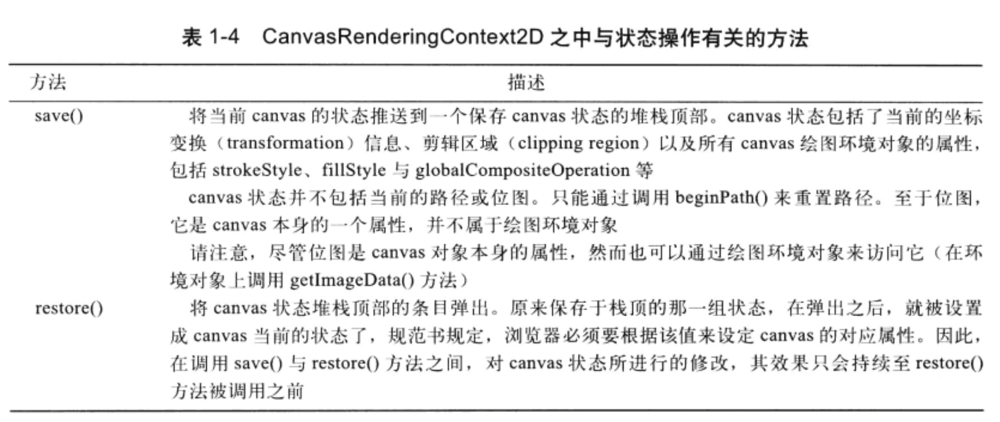

# canvas学习笔记-基础知识

# 一、什么是canvas

什么是 Canvas？Canvas 是为了解决 Web 页面中只能显示静态图片这个问题而提出的，一个可以使用 JavaScript 等脚本语言向其中绘制图像的 HTML 标签。

- 在互联网出现的早期，Web 只不过是静态文本和链接的集合。1993 年，有人提出了 `img` 标签，它可以用来嵌入图像。
- 由于互联网的发展越来越迅猛，Web 应用已经从 Web 文档发展到 Web 应用程序。但是图像一直是静态的，人们越来越希望在其网站和应用程序中使用动态媒体（如音频、视频和交互式动画等），于是 Flash 就出现了。
- 但是随着 Web 应用的发展，出现了 HTML5，在 HTML5 中，浏览器中的媒体元素大受青睐。包括出现新的 `Audio` 和 `Video` 标签，可以直接将音频和视频资源放在 Web 上，而不需要其他第三方。
- 其次就是为了解决只能在 Web 页面中显示静态图片的问题，出现了 `Canvas` 标签。它是一个绘图表面，包含一组丰富的 JavaScript API，这些 API 使你能够动态创建和操作图像及动画。`img` 对静态图形内容起到了哪些作用，`Canvas` 就可能对可编写脚本的动态内容起到哪

# 二、svg 和 Canvas 的区别

## canvas

+ Canvas 是基于像素的即时模式图形系统，绘制完对象后不保存对象到内存中，当再次需要这个对象时，需要重新绘制
+ 在 Canvas 中，一旦图形被绘制完成，它就不会继续得到浏览器的关注。如果其位置发生变化，那么整个场景也需要重新绘制，包括任何或许已被图形覆盖的对象。
+ **Canvas 通过 JavaScript 来绘制 2D 图形**，Canvas 只是一个 HTML 元素，其中的图形不会单独创建 DOM 元素。因此我们不能通过 JavaScript 操控 Canvas 内单独的图形，不能对其中的具体图形进行监控。

## svg

+ svg 是基于形状的保留模式图形系统，绘制完对象后会将其保存在内存中，当需要修改这个对象信息时，直接修改就可以了。这种根本的区别导致了很多应用场景的不同。
+ **svg 本质上是一种使用 XML 描述 2D 图形的语言**。
+ svg（Scalable Vector Graphics，可缩放矢量图形）是基于 XML（可扩展标记语言，标准通用标记语言的子集），用于描述二维矢量图形的一种图形格式。它由 W3C（万维网联盟）制定，是一个开放标准。
+ svg 创建的每一个元素都是一个独立的 DOM 元素，既然是独立的 DOM 元素，那么我们就可以通过 css 和 JavaScript 来操控 dom。可以对每一个 DOM 元素进行监听。

# 三、Canvas应用场景

### 绘制图表

因为 Canvas 通过 JavaScript 可以动态传入参数绘制图形，所以我们可以使用 Canvas 作为容器，通过 JavaScript 动态传入的参数将数据以图表的形式显示出来。

不仅显示更为方便，而且修改数据也同样的简单。同时也可以有一些简单的动画和交互效果，对于可视化的数据展示更为友好。

这些都是传统的 `png/jpg` 静态显示图片所不能比拟的。

现在的一些数据可视化的 js 库（如 ECharts）大部分都是使用 `Canvas` 实现的。

### 小游戏

- 如今人们使用手机的频率越来越高，因此用浏览器打开网址就可以玩的游戏越来越受到开发者和用户的喜爱。
- 而 Canvas 因其独特的性质可以说是 Web 游戏的不二之选，基本上所有的 HTML5 游戏引擎都是基于 Canvas 开发的。那么为什么会使用 Canvas 来开发游戏呢？
- 首先是因为 Canvas 不需要借助任何插件就可以在网页中绘图。并且其强大的绘图 API 可以操纵页面上的每一个元素。

### 活动页面

相信很多的营销活动大家都做过，Canvas 也可以写活动页面哦~(๑•̀ㅂ•́)و，✧这是很多公司的营销策略~

很常见的活动页面，某宝店铺的常见套路，模拟转盘抽奖。点击按钮，转盘转动，然后转盘停止，指针落在哪个区域就提示中奖的奖品。

### 小特效

Canvas 还可以做一些小特效哦，这些小特效可以装饰你 的网站，使它变得更加精致~

# 四、canvas元素

canvas真正的能力是通过 Canvas 的context 对象而表现出来的。该环境变量可以从 canvas 元素身上获取。


请注意canvas 元素内容部分（body）所含的文本，这种文本叫做“后备内容”(fallback )，浏览器仅在不支持 canvas 元素的时候，才会显示该内容。

```html
<canvas id=" canvas " width="600" height= '300'> 
	Canvas not supported（后备内容）
</canvas>
```

## 1.元素的大小和绘图表面的大小

canvas 元素实际上有两套尺寸。 一个是元素本身的大小，还有一个是元素绘图表面 (drawing surface）的大小。

当设置元素的 width 与height 属性时，实际上是同时修改了该元素本身的大小与元素绘图表面的大小。然而，如果是通过CSS 来设定canvas 元素的大小，那么只会改变元素本身的大小， 而不会影响到绘图表面。在默认情况下，canvas 元素与其绘图表面，都是300 像素宽、150 像素。当设置的大小不一致时，这时，有趣的事情就发生了。当 canvas 元素的大小不符合其绘图表面的大小时，浏览器就会对绘图表面进行缩放，使其符合元素的大小。

## 2.绘图环境

canvas 元素仅仅是为了充当绘图环境对象的容器而存在的，该环境对象提供了全部的绘制功能。

### ①2D绘图环境


### ②扩充绘图环境

与每个canvas 相关联的绘图环境对象都是一个功能强大的图形引擎，它支持很多功能， 诸如渐变色、困像合成 (image compositing）、动画等等。不过，它也有局限性，比如，绘园环境对象之中就不包含绘制虛线（dashed line）的方法。由于Javascript 是一门动态语言，所以，你可以向该绘因环境中加人新的方法，或是对已有方法的功能进行扩充。

### ③Canvas 状态的保存与恢复

在进行绘图操作时，需要频繁设置这些值。很多时候只是想临时性地改变这些属性，比如说，可能需要在背景中绘制细网格线， 然后用粗一些的线条在网格之上进行后续的绘图。在这种情况下，需要于绘制网格线时临时性地修改line Width 属性。Canvas 的API提供了两个名叫save0 和restore0 的方法，用于保存及恢复当前 canvas 绘图环境的所有属性。可以像下面讲的这样使用这两个方法：



```

```

提示：save()与restore() 方法可以嵌套式调用

绘图环境的 save0 方法会将当前的绘图环境压入堆栈顶部。对应的restore0 方法则会从堆栈顶部弹出一组状态信息，并据此恢复当前绘困环境的各个状态。这意味着可以嵌套式地调用 saveO/restore0 方法。

